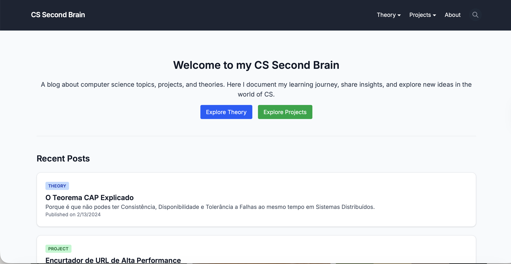

# My CS Second Brain


<br>

<br>
Direct Link to the blog: https://my-cs-second-brain.netlify.app

## Why did I made this and what does it contain?
I'm a senior Computer Science student, and I realized, maybe too late, that because I love to teach, writing a blog about what I learn wouldn’t only help me but others as well. As I’m almost to enter my Master’s degree, this is not the worst idea ever, and it can help me communicate more effectively, as well as understand everything even better. 
This blog contains explanations of CS theory and projects that I've learned and made, organized by tags.

## Key Features
- Generates static HTML at build time.
- Client-side filtering by title, description, and tags without a database.
- Dynamic categorization for "Theory" and "Projects".

## Structure
```bash
src/
├── content/          # The database (Markdown files)
│   ├── projects/     # Practical portfolios
│   └── theory/       # Academic notes
├── layouts/          # Base HTML wrappers (Navbar, Footer)
├── pages/            # Routes (index, search, [slug])
└── styles/           # Global CSS and Tailwind configuration

```

## Running locally

```bash
git clone [https://github.com/ritamaria05/CSBlog.git](https://github.com/ritamaria05/CSBlog.git) # clone the repository
npm install # install dependencies
npm run dev # run the development server
# open http://localhost:4321
```

## License
Distributed under the MIT License.