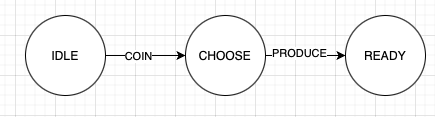
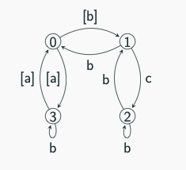

# Transition Systems

As studied in __Basic Concepts of Concurrent Programming - Processes__, a process is made of:

* A set of states
* A set of transitions between states
* An initial state
* A set of actions that makes a state change

An example of a state is the current color of a traffic light, the current value of variables, etc. An example of a transition is when the color of a traffic light changes from red to green, or when a program executes, possibly altering the value of a variable.

More formally, a Labelled Transition System (LTS) is a mathematical model that represents the behaviour of a system, consisting of a set of states and transitions between those states. Its definition is a tuple $(S, \rightarrow, s_0)$, where:

* $S$ is the set of states
* $\rightarrow \subseteq S \times Act \times S$ is the transition relation
* $s_{0} \in S$ is the initial state

$S=\\{IDLE, BURNING,READY\\}$  
$Act = \\{COIN, PRODUCE\\}$  
$\rightarrow = \\{(IDLE, COIN, CHOOSE), (CHOOSE, PRODUCE, READY)\\}$

Instead of writing $(s, \alpha, s’) \in \rightarrow$ , we could write $s \xrightarrow{\alpha} s’$ , where s’ is the successor of s, being $\alpha \in Act$ an action.

$Post(s, \alpha) = \\{ s’ \in S \mid s \xrightarrow{\alpha} s’ \\}$  
$Post(s, A) = \bigcup_{\alpha \in A} Post(s, \alpha), A \subseteq Act$  
$Post(s) = Post(s, Act)$  
$Post(C, \alpha) = \bigcup_{s \in C} Post(s, \alpha), C \subseteq S$  
$Post(C, A) = \bigcup_{s \in C} \bigcup_{\alpha \in A} Post(s, \alpha), C \subseteq S, A \subseteq Act$  

Actions that occur on state $s$: [$Act(s) = \\{ \alpha \in Act \mid \exists s’ : s \xrightarrow{\alpha} s’ \\}$]

Observable actions on state $s$: [$Com(s) = \\{ \alpha \in Com \mid \exists s’ : s \xrightarrow{\alpha} s’ \\}$]

Non-observable actions on state $s$: [$Int(s) = \\{ \alpha \in Int \mid \exists s’ : s \xrightarrow{\alpha} s’ \\}$]

Note: $Act = Com \cup Int$ .

## Achievable States

Let $TS = (S, \rightarrow, s_0)$ be a $LTS$.
A state $s’ \in S$ is achievable by $s$ if $s’=s$ or
$$\exists n \ge 0, s_{1,}s_{2,}…,s_{n}: s \xrightarrow{\alpha_1}s_{1}\xrightarrow{\alpha_2}…\xrightarrow{\alpha_n}s_{n}, s_n=s’$$
In this case, there exists a path of size $n$ between $s$ and $s’$.

A path is acyclic if $s_{i}\neq s_j$  for all $i \neq j$; if not, it is cyclic.

$Reach(s)$ is the set of achievable states of $s$. $Reach(TS)=Reach(s_0)$. 
Let $\rightarrow * \subseteq S \times Act* \times S$ be the reflexive and transitive closure of $\rightarrow$, then $s \xrightarrow{w}* s’$ if and only if $s’ \in Reach(s)$, where $w = \alpha_{1}…\alpha_n$ for some $\alpha_{i}\in Act$.

## Non-determinism

Allows us to describe the behavior of real systems, where it is not necessary to write complete descriptions, but where systems may be too complex, and where parameters are unknown.

Let $TS = (S, \rightarrow, s_0)$ be a $LTS$. $TS$ is deterministic if and only if, for all $s \in S$:
$$(|Post(s)| \le 1) \land (|Act(s)|\le 1) $$
If not, it’s non-deterministic. A system is non-deterministic if it has one state with two or more transitions, but where we don’t know which one is going to happen.

A state $s$ is external non-deterministic if and only if $|Com(s)|>1$ .  
A state $s$ is internal non-deterministic if and only if $|Post(s,Int)|>1$ or $|Post(s,a)|>1$ for some $a \in Com(s)$.  
 
In this LTS, state 1 is external non-deterministic because $Com(1) = \\{c,b\\}$ , so its size is greater than 1.  

States 0 and 2 are internal non-deterministic because:

* $Post(0,Int)=\\{1,3\\}$, where $Int = \\{[a], [b]\\}$ and size is > 1
* $Com(0)$ is empty
* $|Post(2,Int)| = 0$
* $Com(2)=\\{b\\}$
* $Post(2,b) = \\{1,2\\} > 1$
Finally, state 3 is non-deterministic, but neither external nor internal, because:
* $Com(3)=\\{b\\}$, which has size 1
* $Int(3)=\\{[a]\\}$
* $Post(3,[a]) = \\{0\\}$, which has size 1
* $Post(3,b)=\\{3\\}$, which also has size 1

Types of Transition Systems

Let $TS = (S, \rightarrow, s_0)$ , with actions in $Act$.  
* $TS$ is finite if the graph is acyclic and $S$ and $Act$ are finite.  
* $TS$ is finite by states if $S$ and $Act$ are finite sets. 
* $TS$ is limited by ramifications/Bounded Branching when $(\exists k \ge 0)(\forall s \in S)(|Post(s)|\le k)$ : There is a boundary $k$ that no state passes. 
* $TS$ is finitely ramified when $(\forall s \in S)(|Post(s)|\le \infty)$ : Each state $s$ has a finite number of successors with no boundaries whatsoever. 
* If not, it’s infinitely ramified: Exists at least one state $s$ where the number of successors is infinite. 

## Modelling Concurrent Processes

Each process is represented by a transition system (LTS), and time advances when a state changes by a transition (execution of a sequential program). When concurrency occurs with two independent processes, interleaving/shuffle happens, and it’s non-deterministic in every action of the two processes.

### Composition of the State Set

If the system 1 has a state set $S_1$ and the system 2 has a state set $S_2$, the new system will be defined as:
$$S = S_{1}\times S_{2}= {(s_{1,}s_{2})}| s_{1}\in S_{1,}s_{2}\in S_2$$
The initial state will be the initial state pair: $(s_{01}, s_{02})$.