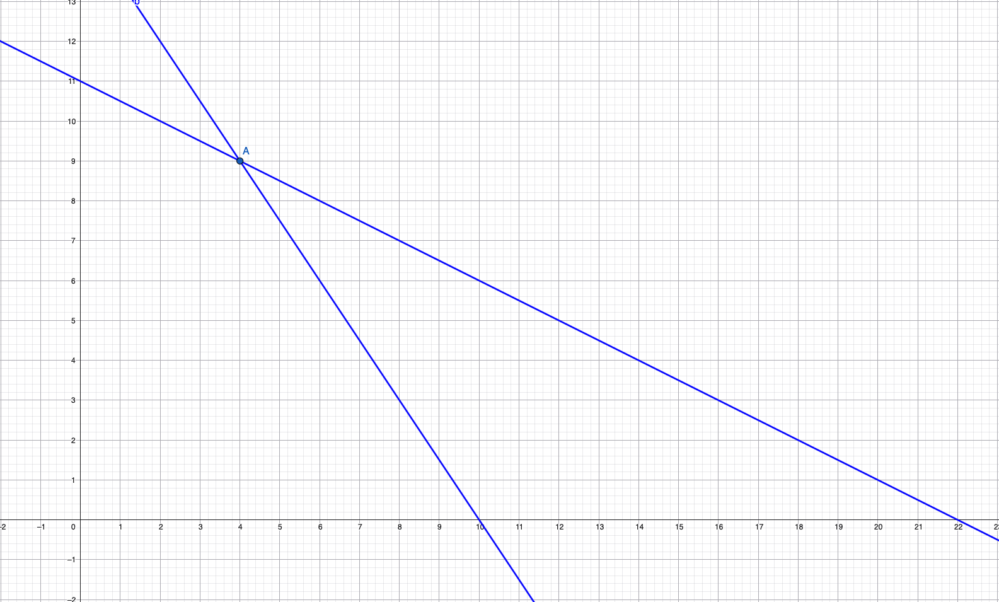
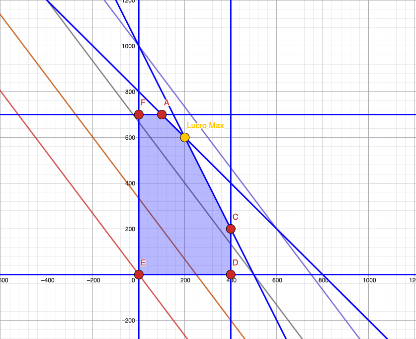

# Mathematical Models for optimisation and decision problems
We are going to explain examples of models thoroughly to understand the basis of a mathematical model.

## Coin Change
Exchange an amount $Q$ using a minimum number of coins. There are $n$ types of coins, being $v_k$, with $1 \leq k \leq n$ their values.  
Case 1: an infinite number of coins  
Case 2: each coin of value $v_k$ is available exactly $d_k$ times, with $1\leq k \leq n$.

### DATA
- $Q$ : amount
- $n$: number of types of coins
- $v_k$: value of a coin $k$
- $d_k$: number of coins $k$ available

### DECISION VARIABLES
$x_k$: How many coins does the value $v_k$ use.

### RESTRICTIONS
$$ \sum_{k=1}^{n} v_{k}x_{k} = Q $$
$$x_{k} \in \mathbb{Z}^{+}_{0}, 1 \leq k \leq n$$
$$x_{k}\leq d_{k}, 1 \leq k \leq n$$
### OBJECTIVE
Minimizing:$$\sum_{k=1}^{n} x_k$$
## Production of tables and chairs
A firm produces tables and chairs and sells them with a profit of 6 u.m and 8 u.m. Each table requires 30 wooden feet, and 5 hours of work. Each chair requires 20 wooden feet and 10 hours of work. You have 300 wooden feet and 110 hours of work. How should be the production so it maximizes the profit?

### DATA
- chairProfit = 8 u.m.
- tableProfit = 6 u.m.
- nrFeetTable = 30
- nrFeetChair = 20
- nrHoursTable = 5
- nrHoursChair = 10
- nrFeet = 300
- nrHours = 110

### DECISION VARIABLES
- $x_T$ = number of tables to produce
- $x_C$ = number of chairs to produce

### RESTRICTIONS
- $30x_{T}+ 20x_{C}\leq 300$ : don't exceed the number of wooden feet available
- $5x_{T}+ 10x_{C}\leq 110$ : don't exceed the number of hours available
- $x_{T}, x_{C}\in \mathbb{Z}^{+}_{0}$ : values are always positive integers

### OBJECTIVE
Maximize the profit value: $6x_{T}+ 8x_C$ 

The point A is the intersection of both expressions written above. Its coordinates are (9,4), with y-axis being $x_C$ and x-axis $x_T$ . The maximum profit value is: $6\times 4 + 8\times 9 = 24 + 72 = 96 u.m.$

## Belt production
A company can make belts of two types: A and B, with profits of 0.4 u.m. and 0.3 u.m. respectively. If we only produced B belts, we could produce up to 1000 belts. The production of a A belt takes double the time of the production of a B belt. On the other hand, we can only obtain leather daily to produce a total of 800 belts (A + B). Because A belts require a special leather, they can only produce a total of 400 belts daily, but B belts can make up to 700 daily. How should be the daily production of that factory?
### DATA
- profitA = 0.4 u.m.
- profitB = 0.3 u.m.

### DECISION VARIABLES
- $x_A$ : number of A belts produced daily
- $x_B$ : number of B belts produced daily

### RESTRICTIONS
- $x_{A,}x_{B}\in \mathbb{Z}^{+}_{0}$
- $x_{A}+ x_{B}\leq 800$
- $2x_{A}+ x_{B}\leq 1000$
- $x_{A}\leq 400$
- $x_{B}\leq 700$

### OBJECTIVE
Maximize profit (u.m.): $0.4 x_{A}+ 0.3 x_B$. The maximum profit is pointed in the image below as the yellow dot. Has coordinates (200,600)

  
A way to find this point is by resolving a system:
$$
\begin{cases}
x_A + x_B = 800 \\
2x_{A}+ x_{B}=1000 
\end{cases}
\equiv
\begin{cases}
x_{B} = 800- x_A \\
2x_{A}+ 800 - x_{A}=1000 
\end{cases}
\equiv
\begin{cases}
x_{B} = 800- 200 \\
x_{A}=200 
\end{cases}
\equiv
\begin{cases}
x_{B} = 600 \\
x_{A}=200 
\end{cases}
$$